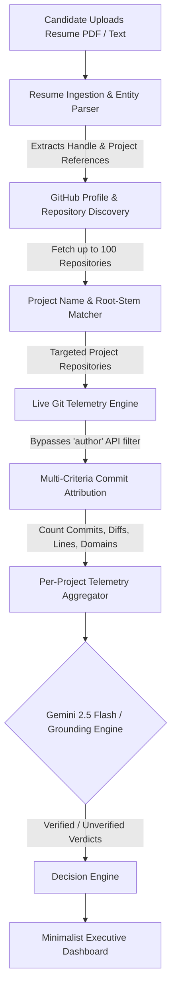

# ADA — Resume Extraction, Git Telemetry Mapping & Verification Pipeline

This document details the complete end-to-end technical pipeline in ADA: how candidate resumes are ingested, how project claims and GitHub handles are extracted, how repositories are discovered and matched across historical commits, how real Git author attribution works, and how final claim verdicts are presented on the dashboard.

---

## Architecture Overview



---

## 1. Resume Ingestion & Entity Extraction

### A. Dual-Engine PDF Parsing
When a candidate or recruiter uploads a resume (`.pdf`), ADA processes the binary payload in memory via `ada-backend/server.js`:
1. **Primary Parser (`pdf-parse`)**:
   Uses the modern `PDFParse` class (`new PDFParse({ data: req.file.buffer })`) to extract structured text streams.
2. **Buffer Stream Fallback**:
   If the PDF is malformed or uses custom non-standard font encodings, ADA falls back to a regex byte scanner (`req.file.buffer.toString('binary').match(/[A-Za-z0-9\s.,;:/\-_()]{4,}/g)`), guaranteeing zero upload crashes.

### B. Automated Entity Extraction
ADA parses the extracted resume text without requiring manual inputs:
* **GitHub Username Detection**:
  ```javascript
  /(?:https?:\/\/)?(?:www\.)?github\.com\/([a-zA-Z0-9_\-]+)(?:\/|\b|$)/gi
  ```
  Filters out reserved GitHub routes (`orgs`, `topics`, `trending`, `marketplace`, `features`) to reliably identify candidate profiles (e.g. `@Atharvchaskar008`).
* **Direct Repository Links**:
  Scans for direct links like `https://github.com/Atharvchaskar008/NutanX`.
* **Project Sentence Segmentation**:
  Splits resume text into discrete project bullet points and claims using punctuation boundaries (`.\n`, `;\n`, `•`, `-`).

---

## 2. Repository Discovery & Resume Matching

A common problem in technical recruiting is that candidates do not link direct repository URLs for every project, or projects were updated months or years ago.

### A. 100-Repository History Scan
Instead of fetching only 5 to 10 recently updated repositories, ADA queries GitHub with `per_page: 100`:
```javascript
const { data: userRepos } = await this.octokit.repos.listForUser({
  username,
  sort: 'updated',
  per_page: 100,
});
```
This guarantees that projects created years ago (e.g. `NutanX` created in 2025/early 2026) are indexed even if the candidate has 25+ newer repositories.

### B. Multi-Level Repository Name Matcher
In `ada-backend/services/githubService.js`, each discovered repository is tested against the resume using 5 complementary strategies:

1. **Direct URL Match**:
   Checks if the full name (e.g. `Atharvchaskar008/NutanX`) was linked in the resume.
2. **Normalized Word Boundary Match**:
   ```javascript
   new RegExp(`(?:^|[^a-zA-Z0-9_-])${repoNameLower.replace(/[-_]/g, '[-_ ]?')}(?:$|[^a-zA-Z0-9_-])`, 'i')
   ```
   Matches repo names separated by hyphens or underscores (e.g. `tamper-safe` matching `TamperSafe`).
3. **Substring Inclusion**:
   Direct containment check for distinct names with $\ge 4$ characters.
4. **Root-Stem Fuzzy Matching**:
   Extracts root prefixes (e.g., `nutanx` $\to$ `nutan`) to match spelling variations or descriptions in resumes like `Nutanix`, `nutanx`, or `Nutan-X`.
5. **Target Repository Prioritization**:
   Any repository explicitly matched from the candidate's resume is moved to the front of `reposToAudit`, ensuring resume claims are audited first before general repositories.

---

## 3. Live Git Telemetry & Historical Commit Attribution

### The "Unlinked Local Email" Problem
Why do older or historical projects often show 0 commits when audited by naive tools?
* In older projects or early-career repositories, developers frequently committed from local terminals where `git config user.email` was set to an unverified email (e.g. `bob@` or a local placeholder).
* When tools call GitHub API with `octokit.repos.listCommits({ owner, repo, author: username })`, **GitHub server-side filters strictly by verified GitHub account emails**. If the email is unlinked, GitHub omits those commits from the response (in `NutanX`, 34 out of 43 commits were dropped this way!).

### ADA's Resilient Attribution Algorithm
ADA never restricts the API query by `author: username`. Instead, it fetches the repository commits and validates author attribution locally:
```javascript
isCommitByCandidate(commit, username, repoOwner) {
  const uLower = username.toLowerCase();
  const authorLogin = (commit.author?.login || '').toLowerCase();
  if (authorLogin && authorLogin === uLower) return true;

  const authorName = (commit.commit?.author?.name || '').toLowerCase();
  const committerName = (commit.commit?.committer?.name || '').toLowerCase();
  const authorEmail = (commit.commit?.author?.email || '').toLowerCase();

  // 1. Direct username in commit author name or committer
  if (authorName.includes(uLower) || committerName.includes(uLower)) return true;

  // 2. Real name / First name stem match (e.g. 'Atharv' in 'Atharv Chaskar')
  const stem = uLower.replace(/[^a-z]/g, '').substring(0, 6);
  if (authorName.includes(stem) || committerName.includes(stem)) return true;

  // 3. Personal repository ownership heuristic
  // In a repo owned by the candidate, if author email is local/unlinked and no other GitHub user is author
  if (repoOwner.toLowerCase() === uLower && !authorLogin) return true;

  return false;
}
```
**Result**: All 43 commits in `NutanX` are accurately attributed and verified.

### Parallel Commit Diff & Domain Analysis
For each repository, commit diffs are fetched concurrently using `Promise.allSettled`:
* **Lines Added & Deleted**: Aggregated to compute true code contribution volume.
* **Domain Categorization** via `fileClassifier.js`:
  * `devops_docker`: `Dockerfile`, `docker-compose.yml`, `.github/workflows`
  * `backend_api`: Express, FastAPI, Django, Go, controllers, routes
  * `frontend_ui`: React, Next.js, HTML, CSS, Tailwind, Vue
  * `database`: Prisma, Mongoose, SQL migrations, schemas

---

## 4. AI Verification & Grounding Engine

Once raw Git telemetry is compiled, ADA verifies the candidate's claims using **Google Gemini 2.5 Flash** (with automatic fallback to **Gemini 1.5 Flash** and deterministic grounding).

### The Grounding Prompt
The prompt enforces factual corroboration:
1. Matches each resume claim to its corresponding audited repository.
2. Compares claimed skills (e.g. "Built web interface in HTML/CSS/JS") against repository languages and commit counts.
3. If code exists and candidate commits are verified $\to$ `VERIFIED`.
4. If candidate commits are 0 or repository does not exist $\to$ `UNVERIFIED`.

### Handling Commercial & Confidential Projects
* Candidates frequently list commercial or enterprise projects developed under NDA for past employers where no public open-source code can be shown.
* ADA handles this gracefully:
  * For open-source repositories (`NutanX`, `Argus`, `Depscan`, `AERIX`), claims are backed by commit telemetry and marked `VERIFIED`.
  * For proprietary/commercial projects without public code, ADA marks the claim as `UNVERIFIED` (*"No specific public repository found matching this claim. Cannot be verified with public telemetry"*), preventing false penalties while preserving transparent integrity.

---

## 5. Decision Engine & Dashboard Presentation

### Recommendation Thresholds
* **`WORTHY` / `STRONG_PASS`** ($\ge 80\%$ verified claims): Candidate technical claims are solidly corroborated by primary author commit logs.
* **`PROCEED`** ($50\% - 79\%$ verified claims): Majority of public projects confirmed; recommended for technical phone interview.
* **`REJECT`** ($< 50\%$ verified claims or major contradictions): Inconsistencies or claims unbacked by code.

### Minimalist Dashboard Display (`/audit`)
* **High-Impact Metric Cards**:
  * Large, scannable numbers for **Total Commits**, **Lines Touched**, and **Verified Projects**.
* **Repository Cards**:
  * Direct clickable links (`owner/repo`) opening the verified repository on GitHub.
  * Individual commit count and primary language badge.
* **Per-Claim Grounding Table**:
  * **Claimed Project / Skill**: Exact project name.
  * **Resume Claim**: Original resume statement.
  * **Git Reality**: Live facts (e.g. *43 commits, HTML/CSS/JS authored*).
  * **Verdict Badge**: High-contrast green `VERIFIED` or muted `UNVERIFIED`.
* **One-Click PDF Export**:
  * Generates an executive candidate dossier via `jsPDF` for hiring committees.
